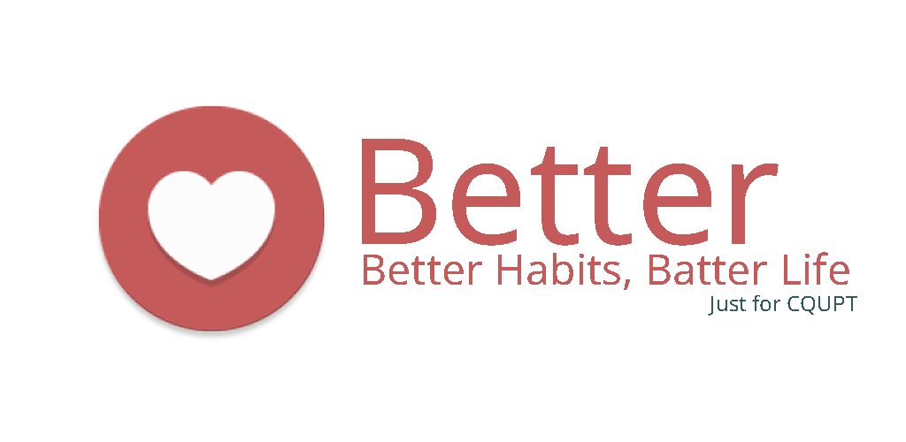

[simonla](https://github.com/simonla)

### 您拥有一双与生俱来的翅膀，为什么要爬行度过这一生呢？

> You were born with potential,

> You were born with ideals and dreams.

> You were born with greatness.

> You were born with wings.

> You are not meant for crawling, so don't.

> You have wings.

> Learn to use them and fly!

在过去的一年里，我在CQUPT学习编程

* 熬夜

* 不吃早饭

* 水课就逃

* ...

养成了很多不好的习惯

于是就有了做这款工具的念头

希望它能改掉我这些毛病

伴随着熬夜，不吃早饭

如你所见

这款软件诞生了（笑

不管怎么样，新学期就快开始了

如果你和我一样

也有这些坏习惯

不妨试试

还有很多功能没有完善

我们也将继续更新它

### 开发工作

[Haruue](https://github.com/haruue) 不辞辛劳，拔来了重邮的课表信息

用RxJava+Retrofit等高大上的库完成了本软件的数据处理，数据库编写

在这里感谢他

[Simonla](https://github.com/simonla) 尽自己所能，完成了UI设计，教程编写，文案工作

虽怀尽善尽美之心，然有白璧微瑕之憾

望谅解

感谢开源

协议就不写在这里啦

### 免责声明 

**本软件部分图片取自Fabulous.Inc，已取得授权，著作权属Fabulous.Inc所有**

**本软件课表数据来自RedRock，未经授权，不得使用**

