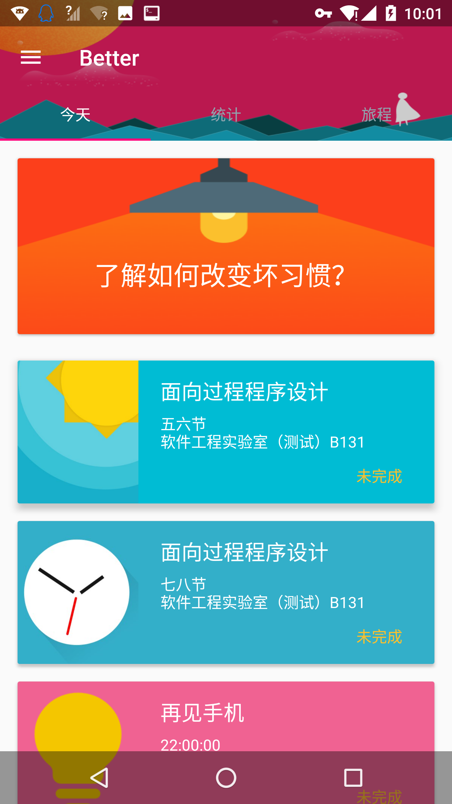
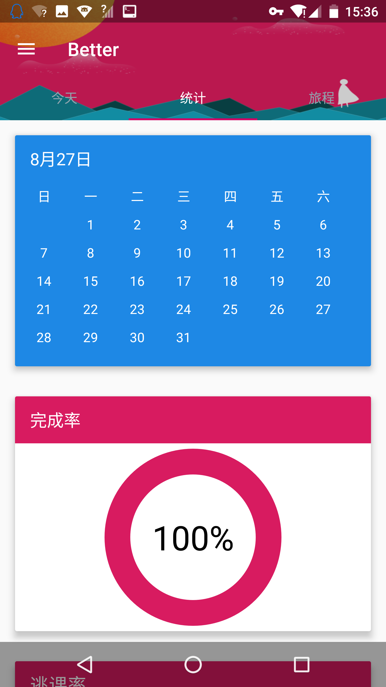
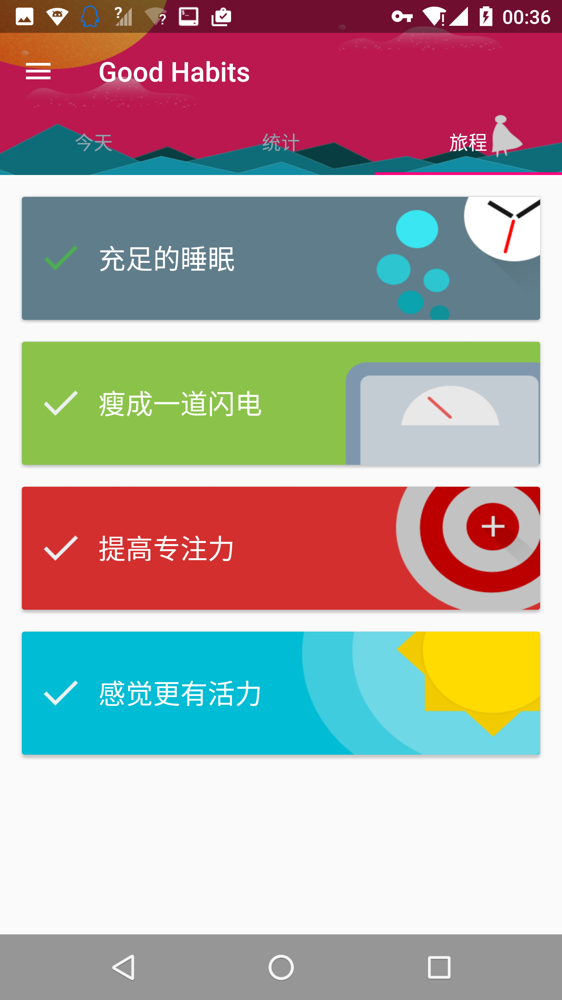
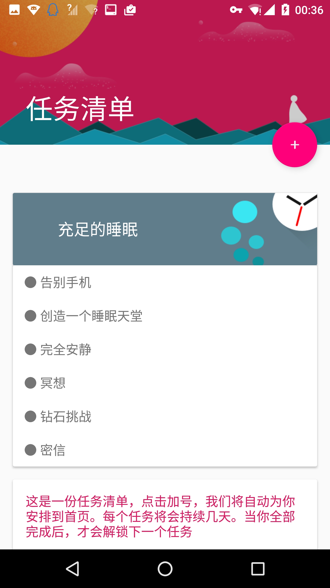
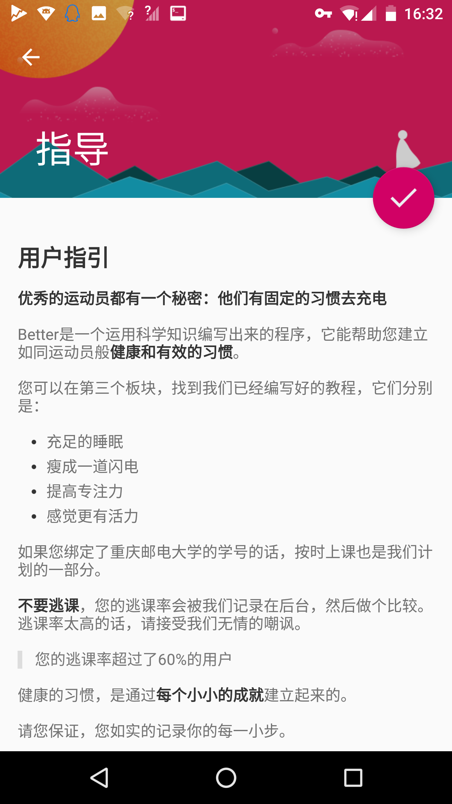

~~GoodHabits~~ Better
======================
### 本文是项目的 README ，关于 APP 的说明请阅读 simonla 写的 [关于](ABOUT_APP.md)

## 概览
这是一个帮助你规划生活，改掉坏习惯的 APP    

## 功能
+ 今天 - 与课程表一起显示你一天的日程
+ 统计 - 统计你自安装本 APP 开始之后，每天计划的完成率，~~以及逃课率~~
+ 旅程 - 能让你养成好习惯的方法，点击即可自动安排时间并加入日程
+ 指导 - 为养成好习惯提供有用的教程和激励
+ 课程表同步 - 输入学号即可导入重邮课程表，更方便地规划每一天（现在是暑假当然刷不出课表）

## 未（还）完（没）善（有）的功能
+ 添加自定义日程
+ 更多的计划，帮助你改掉更多的坏习惯
+ 添加并分享自定义规划，有好的窍门可以和别人共享

## 屏幕截图






## 下载

<!--
<a href='https://play.google.com/store/apps/details?id=moe.haruue.goodhabits&utm_source=global_co&utm_medium=prtnr&utm_content=Mar2515&utm_campaign=PartBadge&pcampaignid=MKT-Other-global-all-co-prtnr-py-PartBadge-Mar2515-1'></a>
-->
[或点击此处直接下载 APK 安装包](app/app-release.apk?raw=true)

## 考核
这个项目作为红岩移动开发部 Android 方向的最终考核。
+ 目前此考核已结束。

## License

``` License
Copyright 2016 Simonla, Haruue Icymoon

Licensed under the Apache License, Version 2.0 (the "License");
you may not use this file except in compliance with the License.
You may obtain a copy of the License at

    http://www.apache.org/licenses/LICENSE-2.0

Unless required by applicable law or agreed to in writing, software
distributed under the License is distributed on an "AS IS" BASIS,
WITHOUT WARRANTIES OR CONDITIONS OF ANY KIND, either express or implied.
See the License for the specific language governing permissions and
limitations under the License.

```